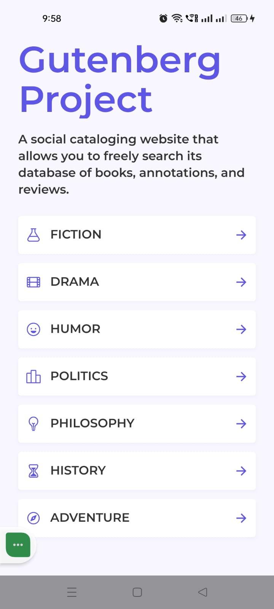
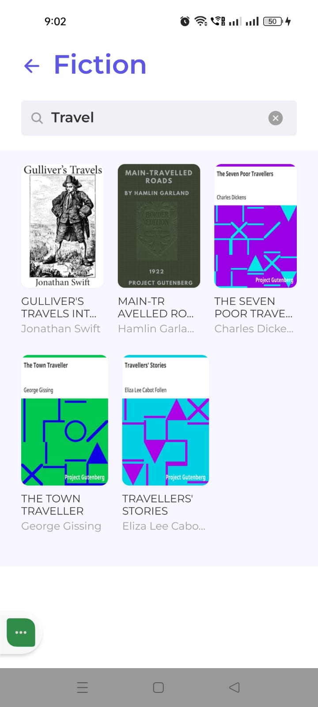
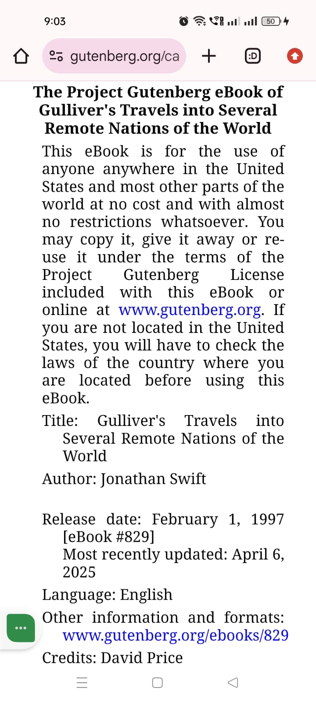

# Gutenberg Project

This app contains a responsive React Native mobile cataloging application built using the Gutendex API. Users can browse books by genre, search by title/author, read books in their browser, and toggle themes and languages automatically.

---

## 📱 Demo Video & Screenshots

### Demo Video

Watch the demo video demonstrating both portrait and landscape layouts:


### 📦 Android APK

Download the pre-built release APK:
- [GutenbergProject.apk](./screenshots,video,apk/GutenbergProject.apk)

### Screenshots

#### Genre Listing


#### Books Listing


#### Search & Filter


#### Web Reader


---

## 📖 Project Overview

This app is a social cataloging client for the Gutendex API (hosted Project Gutenberg catalog). Key features:

- **Genre Directory**: Quick access to categories (Fiction, Drama, Humor, Politics, Philosophy, History, Adventure).
- **Infinite Scrolling**: Lazy loads books as the user scrolls, fetching page-by-page from the API.
- **Unified Search**: Search title and author dynamically via API queries while maintaining the active genre filter.
- **Browser Integration**: Automatically resolves and opens preferred ebook formats in the device's web browser, preferring HTML > PDF > TXT.
- **Responsive Layout**: Designed for mobile and tablet devices, adapting layout and grid structures dynamically between portrait and landscape orientations.
- **Offline Cache**: Instantly caches book metadata using high-performance MMKV storage for fast offline browsing.
- **Multilingual Support**: Fully localized in English, Spanish, Hindi, and Tamil.

---

## 🛠 Setup & Run Instructions

> [!NOTE]
> Currently, this project targets and supports the Android platform only.

### Prerequisites

- Node.js >= 22.11.0
- Android SDK & Emulator/Device (supported versions):
  - **Minimum Android version**: API Level 24 (Android 7.0)
  - **Target Android version**: API Level 36 (Android 15)
  - **Compile SDK version**: API Level 37
  - **Gradle version**: 9.4.1

### 1. Installation

Clone the repository and install npm packages:

```bash
npm install
```

### 2. Environment Configuration

Create a `.env` file in the root directory:

```ini
API_BASE_URL=https://gutendex.careers.ignitesol.com/books
NEXT_URL_TARGET=http://gutendex-api:8974
NEXT_URL_REPLACEMENT=https://gutendex.careers.ignitesol.com
```

### 3. Running the App

#### Start Metro Bundler

```bash
npx react-native start
```

#### Run on Android

```bash
npx react-native run-android
```

#### Running Tests

```bash
npm run test
# OR
npx jest
```

#### Running Linter

```bash
npm run lint
```

---

## 🏗 Architecture Overview

The app follows a structured **Feature-Based Layered Architecture**:

```
src/
├── features/          # Feature modules
│   └── books/         # Books feature directory
│       ├── api/       # Axios API layer
│       ├── components/# Reusable UI components (BookCard, GenreCard, etc.)
│       ├── constants/ # Constants, genres, and translated string keys
│       ├── hooks/     # Custom React hooks (useBooks, etc.)
│       ├── screens/   # App screens (GenreScreen, BookListScreen)
│       └── store/     # Redux slices and state managers
├── navigation/        # React Navigation stack config
├── services/          # Services (i18n, storage, theme)
├── store/             # Global Redux store configuration
├── ui/                # Shared theme & style systems
└── utils/             # Helper utilities
```

### Key Architectural Systems

1. **State Management**: Redux Toolkit handles book lists, loading, and errors.
2. **Local Storage**: `react-native-mmkv` provides fast, low-overhead key-value storage for cached books.
3. **Localization**: `i18next` combined with `react-native-localize` detects the device language and loads localized strings dynamically.
4. **Environment Config**: `react-native-dotenv` injects env variables into build-time assets.
5. **React Hooks**:
   - **Custom Hooks**:
     - `useBooks`: Handles debounced search, infinite scroll pagination, pull-to-refresh, browser redirection, and loading/error modal states.
     - `useExitApp`: Listens to hardware back presses on Android to prompt the exit confirmation dialog.
     - `useAppTheme`: Custom hook that dynamically updates light/dark colors using system color scheme.
   - **Standard & Third-Party Hooks**:
     - `useState`, `useEffect`, `useCallback`, `useMemo`: Manage state, run side-effects, and optimize component render cycles.
     - `useWindowDimensions`: Detects screen dimension changes dynamically for portrait/landscape grid responsiveness.
     - `useTranslation`: Accesses internationalization context from `react-i18next`.
     - `useDispatch`, `useSelector`: Connect components to Redux store.

### Theming, Multi-lingual & Accessibility Design

- **Theming**: Architected in [theme.ts](./src/ui/theme.ts). Features `lightColors` and `darkColors` corresponding to styleguide specifications. Color scheme switches automatically with device configuration via the `useAppTheme` hook. Easily modifiable.
- **Multi-lingual**: Localization JSON files reside in [locales directory](./src/services/i18n/locales). Adding a language is as simple as adding a translation file (e.g. `fr.json`) and updating the registration config in [index.ts](./src/services/i18n/index.ts).
- **Accessibility**: Configured React Native accessibility props to assist screen readers:
  - Custom components (e.g., `BookCard`, `GenreCard`) and interactive headers utilize exact `accessibilityRole="button"` and `accessibilityRole="search"`.
  - Dynamic details like `` accessibilityLabel={`${item.title} by ${author} `` and `` accessibilityLabel={`Genre ${item.title}`} `` provide meaningful audio descriptions.

### System Configuration

- **Babel Configuration**:
  - [babel.config.js](./babel.config.js) uses `babel-plugin-module-resolver` to map `@/*` import paths to `./src`.
  - Integrates `module:react-native-dotenv` Babel plugin for compile-time environment variable injection.
- **Jest Configuration**:
  - [jest.config.js](./jest.config.js) maps `@env` to the mock file `__tests__/__mocks__/env.js` and resolves `@/*` aliases.
  - Mocks native mobile dependencies (`react-native-mmkv`, `netinfo`, `localize`, `safe-area-context`).
- **React Native Testing Library**:
  - Used for unit and integration testing of hooks, APIs, Redux slices, and UI components using `@testing-library/react-native`.
- **Asset & Font Configuration**:
  - Configured custom Montserrat fonts under `./assets/fonts/` as per the design requirements in the PDF style guide.
  - Linked using [react-native.config.js](./react-native.config.js) to bundle custom assets.

---

## 🔌 API Integration & Query Handling

The app communicates with the Gutendex REST API at `/books`. Different query parameters are dynamically managed to satisfy specific filtering, search, and page loading states:

1. **Genre Filtering (`topic`)**:
   - Parameter name: `topic`
   - Maps the selected UI category (e.g., "Fiction", "Drama", "History") converted to lowercase (e.g., `topic=fiction`).
   - Filters results by Gutendex bookshelf or subject keywords.

2. **Cover Image Enforcement (`mime_type`)**:
   - Parameter name: `mime_type`
   - Hardcoded to `'image'` (e.g., `mime_type=image`) for all requests.
   - Enforces that only books containing an image MIME-type (cover previews) are returned, resolving the assessment requirement.

3. **Unified Text Search (`search`)**:
   - Parameter name: `search`
   - Appends the query input from the search bar (e.g., `search=vampire`) with debouncing of 500ms.
   - Matches text against book titles and author names within the currently active `topic` (genre) filter.

4. **Cursor-Based Pagination (`page` via `nextUrl`)**:
   - The Gutendex API returns a full pagination URI in the `next` property (e.g., `http://gutendex-api:8974/books/?page=2&mime_type=image&topic=fiction`).
   - For consecutive infinite scroll fetches, the client parses and requests this URL directly, dynamically remapping the docker domain host to the public production endpoint.

---

## 📦 Third-Party Libraries Used

| Library                                                           | Purpose                                     |
| :---------------------------------------------------------------- | :------------------------------------------ |
| **@reduxjs/toolkit** & **react-redux**                            | Centralized global state management         |
| **axios**                                                         | HTTP networking client                      |
| **react-native-mmkv**                                             | High-performance offline key-value storage  |
| **react-native-localize**                                         | Detects device system language and region   |
| **i18next** & **react-i18next**                                   | Dynamic runtime localization                |
| **react-native-reanimated**                                       | Fluid animations and layout transitions     |
| **react-native-vector-icons**                                     | Consistent iconography                      |
| **react-native-dotenv**                                           | Secure environment variables                |
| **@react-navigation/native** & **@react-navigation/native-stack** | Screen navigation and transition management |
| **react-native-safe-area-context**                                | Safe area inset handling                    |
| **react-native-screens**                                          | Native OS optimization for view layers      |

---

## 🤖 AI Tools Used

- **Google Antigravity AI**: Assisted with environment variable configuration, TypeScript typing, layout structure, and Jest testing setups.

### Validation & Adaptation of AI-Generated Code

AI-generated suggestions were validated and adapted by:

- Running automated test suites via `npm run test` (including unit tests for screens, custom hooks, APIs, and Redux slices).
- Executing strict static analysis through `npm run lint`.
- Manually running the application on Android physical device, checking for UI consistency, theming, localization, and portrait/landscape responsiveness.

---

## ⚠️ Assumptions & Known Limitations

- **MIME-Type Image Filter**: The app requests `mime_type: 'image'` in API calls to ensure all displayed books have covers, as recommended in the assessment requirements.
- **Next Page Domain Remapping**: The Gutendex API returns next-page URLs referencing an unreachable internal docker hostname (`http://gutendex-api:8974`). The app rewrites these to the public gateway `https://gutendex.careers.ignitesol.com` at runtime using env variables.
- **Zip Files**: Ebooks returned as `.zip` formats are skipped in browser selection as they are not natively viewable in standard mobile web views.
- **Unviewable Alert**: If a book contains no HTML, PDF, or TXT formats, the app prompts a native alert stating "No viewable version available".
